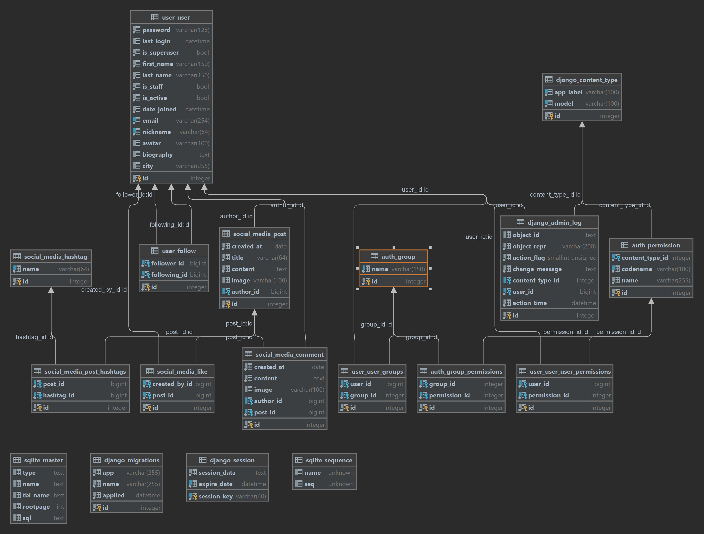

# Social Media API 📱🌐

## Description 🚀

Welcome to the Social Media API, a RESTful service for a feature-rich social media platform. This API empowers users to
manage profiles, engage with content, and perform various social media actions. From user registration to post creation
and interaction, this API is designed to provide a seamless social media experience.

## Key Features 🔑

### Authentication 🔐

- User registration with email and password.
- Token-based authentication for secure access.
- Logout functionality to invalidate tokens.

### User Profile 🧑‍🤝‍🧑

- Create and update user profiles with bio, profile picture, and more.
- Retrieve user profiles, including your own and others'.
- Search functionality to find users by username or criteria.

### Follow/Unfollow 🔄

- Follow and unfollow other users.
- View lists of followed and followers.

### Post Creation and Retrieval 📝

- Create posts with text content and optional media attachments.
- Retrieve your own posts and posts from followed users.
- Search posts by hashtags or other criteria.

### Likes and Comments ❤️💬

- Like and unlike posts.
- View liked posts and add comments.
- View comments on posts.

### API Permissions 🛡️

- Authenticated users only for actions like post creation, liking, and following.
- Update and delete own posts, comments, and profile.

### API Documentation 📚

- Comprehensive Swagger UI documentation.
- Clear instructions on each endpoint.
- Sample API requests and responses.

## DB Structure 💻

## How to Run ▶️

1. Create a virtual environment: `python -m venv venv`
2. Activate the virtual environment:
   - On Windows: `venv\Scripts\activate`
   - On macOS: `source venv/bin/activate`
3. Install dependencies: `pip install -r requirements.txt`
4. Apply migrations: `python manage.py migrate`
5. Run the development server: `python manage.py runserver`

Explore the API using the provided Swagger UI and refer to the documentation for detailed instructions.
